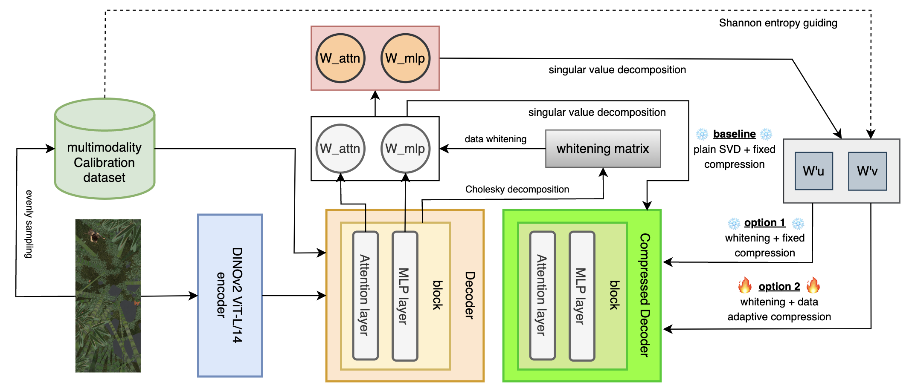

# SVD-π3: Efficient Visual Geometry Learning via Singular Value Decomposition

## SVD-π3 Pipeline



## 🔥 SVD-π3 Implementation Roadmap

- [x] Truncation-Aware Data Whitening
  - [x] collect calibration data
    - [x] sintel_training_ALLMODS_512_224_8_10_3.pt (64 batches, 512 images)
  - [x] derive the whitening matrix via profiling 
    - [x] fallback to EVD when Cholesky fails ("✅95/144 succeeded with Cholesky, 49/144 used EVD fallback")
  - [x] apply whitening
    - [x] SVD_Pi3Attention
    - [x] SVD_Pi3MLP
    - [x] Pi3_whitening
      - [x] hierarchical attempts on SVD (float32 GPU -> float64 GPU -> float64 CPU)
- [x] evaluation
  - [x] performance/accuracy evaluation (for now, focus on depth estimation)
    - [x] in order to load checkpoints, implement a CompressedPi3 that inherits Pi3 
    - [x] load the (whitened + compressed) checkpoints
    - [x] run evaluation
  - [x] efficiency evaluation
    - [x] throughput (img/sec)
- [ ] LoRA finetuning 
  - [x] wrap CompressedPi3 with LoRA
  - [ ] implement Pi3TrainerLoRA from Pi3Trainer [in progress!](Pi3_main/trainers/pi3_trainer.py)
  - [ ] TBD
  - [ ] TBD
- [ ] task-agnostic LoRA finetuning (TBD)


## 🔥 SVD-π3 Implementation details (commands + results)

### Truncation-aware data whitening

```bash
# stay in 'SVD-pi3' (root directory)
CUDA_VISIBILE_DEVICES=0 python Pi3_main/SVDPi3.py --step 1 --ckpt Pi3_main/pi3_model.safetensors --save_path /data/wanghaoxuan/SVD_Pi3_cache
```

### Evaluation

- [x] Monocular Depth Estimation

```bash
# stay in 'SVD-pi3' (root directory)
python Pi3_evaluation/monodepth/infer.py
python Pi3_evaluation/monodepth/eval.py
```

original π3:

```python
{'Abs Rel': 0.2796176944859495, 'Sq Rel': 1.276705312700384, 'RMSE': 3.7178159584027632, 'Log RMSE': 0.5286988564434099, 'δ < 1.': 0.0, 'δ < 1.25': 0.616369625758487, 'δ < 1.25^2': 0.78750964094564, 'δ < 1.25^3': 0.8520245890568844}
```

```log
[2025-09-15 19:56:42,655][monodepth-infer][INFO] - Overall throughput: 6.66 images/second
```

compressed π3 (no LoRA finetuned):

```python
{'Abs Rel': 0.7001590852341619, 'Sq Rel': 5.015428265738036, 'RMSE': 7.187596822293912, 'Log RMSE': 0.6972085129552443, 'δ < 1.': 0.0, 'δ < 1.25': 0.3193632831349897, 'δ < 1.25^2': 0.5601810225270805, 'δ < 1.25^3': 0.7066331125178978}
```

```log
[2025-09-15 19:52:35,451][monodepth-infer][INFO] - Overall throughput: 7.75 images/second
```

- [ ] Video Depth Estimation

- [ ] Relative Camera Pose Estimation

- [ ] Point Map Estimation

### LoRA finetuning

```bash
CUDA_VISIBLE_DEVICES=0 taskset -c 30-40 python Pi3_main/Pi3_LoRA.py --prune_model /data/wanghaoxuan/SVD_Pi3_cache/Pi3_whitening_only_0.8.safetensors --data_path yahma/alpaca-cleaned --output_dir ./first_half --lora_target_modules q_u_proj,k_u_proj,v_u_proj,o_u_proj,gate_u_proj,down_u_proj,up_u_proj --lora_r 8 --num_epochs 3 --learning_rate 1e-4 --batch_size 4 --micro_batch_size 1 --cutoff_len 1024 --group_by_length
```


## SVD-LLM preliminaries

### Truncation-Aware Data Whitening

using the calibration dataset for data whitening:

```bash
CUDA_VISIBLE_DEVICES=<whichever_is_free> python SVDLLM.py --model jeffwan/llama-7b-hf --step 1 --ratio 0.2 --whitening_nsamples 256 --dataset wikitext2 --seed 3 --model_seq_len 2048 --save_path . --run_low_resource
```

perplexity evaluation:

```bash
CUDA_VISIBLE_DEVICES=<whichever_is_free> taskset -c 30-40 python SVDLLM.py --step 4 --model_path jeffwan_llama_7b_hf_whitening_only_0.8.pt
```

```java
PPL after pruning: {'wikitext2': 7.886700954800093}
Weight Memory: 22004.896484375 MiB
```

efficiency evaluation:

```bash
CUDA_VISIBLE_DEVICES=<whichever_is_free> taskset -c 30-40 python SVDLLM.py --step 5 --model_path jeffwan_llama_7b_hf_whitening_only_0.8.pt
```

```java
Total Memory: 28.538090705871582 GB
Weight Memory: 20.503570556640625 GB
Activation Memory: 8.026554107666016 GB
Throughput: 69.48256829185354 tokens/sec
```

### Finetuning with LoRA

update W'u (~35 hours):

```bash
CUDA_VISIBLE_DEVICES=<whichever_is_free> nohup taskset -c 30-40 python utils/LoRA.py --prune_model jeffwan_llama_7b_hf_whitening_only_0.8.pt --data_path yahma/alpaca-cleaned --output_dir ./first_half --lora_target_modules q_u_proj,k_u_proj,v_u_proj,o_u_proj,gate_u_proj,down_u_proj,up_u_proj --lora_r 8 --num_epochs 3 --learning_rate 1e-4 --batch_size 4 --micro_batch_size 1 --cutoff_len 1024 --group_by_length &
```

```java
{'train_runtime': 128586.2054, 'train_samples_per_second': 1.161, 'train_steps_per_second': 0.29, 'train_loss': 1.0868874290876194, 'epoch': 3.0}
```

Immediate evaluation:

```bash
CUDA_VISIBLE_DEVICES=<whichever_is_free> taskset -c 30-40 python SVDLLM.py --model_path jeffwan_llama_7b_hf_whitening_only_0.8.pt --lora ./first_half --step 4
```

```java
PPL after pruning: {'wikitext2': 7.23282080013519}
Weight Memory: 22004.896484375 MiB
```

Update W'v:

```bash
CUDA_VISIBLE_DEVICES=<whichever_is_free> nohup taskset -c 30-40 python utils/LoRA.py --prune_model ./first_half/merge.pt --data_path yahma/alpaca-cleaned --output_dir ./second_half --lora_target_modules q_v_proj,k_v_proj,v_v_proj,o_v_proj,gate_v_proj,down_v_proj,up_v_proj --lora_r 8 --num_epochs 3 --learning_rate 1e-4 --batch_size 4 --micro_batch_size 1 --cutoff_len 1024 --group_by_length &
```

Immediate evaluation:

```bash
PYTHONNOUSERSITE=1 CUDA_VISIBLE_DEVICES=0 taskset -c 30-40 python SVDLLM.py --model_path jeffwan_llama_7b_hf_whitening_only_0.8.pt --lora ./first_half /first_half --step 4
```

```java
coming soon!
```

Final evaluation:

```bash
PYTHONNOUSERSITE=1 CUDA_VISIBLE_DEVICES=0 taskset -c 30-40 python SVDLLM.py --model_path ./first_half/merge.pt --lora ./second_half --step 4
```

## Efficiency Measurement

HuggingFace repo for π3 model: [yyfz233/Pi3](https://huggingface.co/yyfz233/Pi3)

get forward pass (ms) and throughput (frames/sec):

```bash
CUDA_VISIBLE_DEVICES=0 python example.py --ckpt ./pi3_model.safetensors --efficiency_measure simple
```

| model | forward pass (ms) | throughput (frames/sec) |
| ----- | ----------------- | ----------------------- |
| original π3 | 1530.90 | 7.19 |
| SVD-π3 (coming soon!) | ? | ? |

detailed profiling:

```bash
CUDA_VISIBLE_DEVICES=0 python example.py --ckpt ./pi3_model.safetensors --efficiency_measure profiler
```

</img>

## Evaluation

### Monocular Depth Estimation

dataset collection:

- [x] Sintel
- [ ] Bonn
- [ ] KITTI
- [ ] NYU-v2

Sintel dataset:
| model | Abs Rel | Sq Rel | RMSE | Log RMSE |
| ----- | ------ | ---- | ----- | ------ |
| original π3 | 0.2796 | 1.2767 | 3.7178 | 0.5286 | 
| SVD-π3 (coming soon!) | ? | ? | ? | ? |

### Video Depth Estimation

dataset collection:

- [x] Sintel
- [ ] Bonn
- [ ] KITTI
- [ ] NYU-v2

Sintel dataset:
| model | Abs Rel | Sq Rel | RMSE | Log RMSE |
| ----- | ------ | ---- | ----- | ------ |
| original π3 | 0.2106 | 1.2873 | 4.0003 | 0.4840 | 
| SVD-π3 (coming soon!) | ? | ? | ? | ? |


### Relative Camera Pose Estimation

dataset collection:

- [ ] RealEstate10K (too big for now; TB level)
- [x] Sintel
- [ ] TUM-dynamics
- [ ] ScanNetv2

Sintel dataset:
| model | ATE | RPE trans | RPE rot |
| ----- | ------ | ---- | ----- |
| original π3 | 0.0732 | 0.0390 | 0.2766 |
| SVD-π3 (coming soon!) | ? | ? | ? |


### Point Map Estimation

dataset collection:

- [x] 7-Scenes
  - [x] preprocessing
- [ ] Neural-NRGBD
- [ ] DTU

7-scenes-dense:

| model | Acc-mean | Acc-med | Comp-mean | Comp-med | NC-mean | NC-med | NC1-mean | NC1-med | NC2-mean | NC2-med |
| ----- | -------- | ------- | --------- | -------- | ------- | ------ | -------- | ------- | -------- | ------- | 
| original π3 | 0.0157 | 0.0066 | 0.0220 | 0.0105 | 0.6886 | 0.7920 | 0.6913 | 0.7975 | 0.6859 | 0.7865 |
| SVD-π3 (coming soon!) | ? | ? | ? | ?  | ? | ? |  ? |  ? |  ? | ? |  

7-scenes-sparse:

| model | Acc-mean | Acc-med | Comp-mean | Comp-med | NC-mean | NC-med | NC1-mean | NC1-med | NC2-mean | NC2-med |
| ----- | -------- | ------- | --------- | -------- | ------- | ------ | -------- | ------- | -------- | ------- | 
| original π3 | 0.0469 | 0.0284 | 0.0736 | 0.0484 | 0.7413 | 0.8402 | 0.7446 | 0.8427 | 0.7379 | 0.8378 |
| SVD-π3 (coming soon!) | ? | ? | ? | ?  | ? | ? |  ? |  ? |  ? | ? |  
