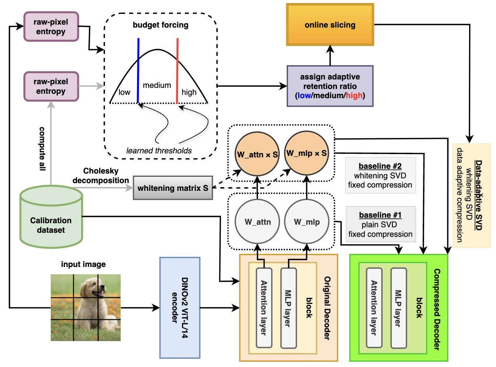

<p align="center">

</p>

<h1 align="center">SVD-π3</h1>
<h2 align="center">Data-adaptive SVD for Efficient Visual Geometry Learning</h2>

## Environment

```bash
source ~/envs/compress/bin/activate
```

## Latency/Efficiency eval

GFLOP measurement:

```bash
PYTHONNOUSERSITE=1 CUDA_VISIBLE_DEVICES=1 python Pi3_evaluation/latency_measure.py
```

Parameter measuring:

```bash
CUDA_VISIBLE_DEVICES=3 PYTHONNOUSERSITE=1 python Pi3_evaluation/param_measure.py
```


## Baseline 1: plain SVD

For Pi3:

```bash
# stay in 'SVD-pi3' (root directory)
CUDA_VISIBLE_DEVICES=0 PYTHONNOUSERSITE=1 python Pi3_main/SVDPi3.py --ckpt /data/wanghaoxuan/yusen_stuff/SVD_Pi3_cache/pi3_model.safetensors --save_path /data/wanghaoxuan/yusen_stuff/SVD_Pi3_cache --ratio 0.2 --baseline
```

For VGGT:

```bash
CUDA_VISIBLE_DEVICES=1 PYTHONNOUSERSITE=1 python Pi3_evaluation/SVD_VGGT.py --save_path /data/wanghaoxuan/yusen_stuff/SVD_Pi3_cache --ratio 0.2 --calibration_dataset_path /data/wanghaoxuan/yusen_stuff/scannetv2 --baseline
```

## Baseline 2: data whitening SVD

For Pi3:

```bash
# stay in 'SVD-pi3' (root directory)
CUDA_VISIBLE_DEVICES=0 PYTHONNOUSERSITE=1 python Pi3_main/SVDPi3.py --ckpt /data/wanghaoxuan/yusen_stuff/SVD_Pi3_cache/model.safetensors --save_path /data/wanghaoxuan/yusen_stuff/SVD_Pi3_cache --ratio 0.2 --calibration_dataset_path /data/wanghaoxuan/yusen_stuff/scannetv2 --whitening_nsamples 256
# or a diverse calibration dataset
CUDA_VISIBLE_DEVICES=0 PYTHONNOUSERSITE=1 python Pi3_main/SVDPi3.py --ckpt /data/wanghaoxuan/yusen_stuff/SVD_Pi3_cache/model.safetensors --save_path /data/wanghaoxuan/yusen_stuff/SVD_Pi3_cache --ratio 0.2 --calibration_dataset_path diverse --whitening_nsamples 256
```


For VGGT:

```bash
CUDA_VISIBLE_DEVICES=0 PYTHONNOUSERSITE=1 python Pi3_evaluation/SVD_VGGT.py --ckpt /data/wanghaoxuan/yusen_stuff/SVD_Pi3_cache/model.safetensors --save_path /data/wanghaoxuan/yusen_stuff/SVD_Pi3_cache --ratio 0.2 --calibration_dataset_path /data/wanghaoxuan/yusen_stuff/scannetv2 --whitening_nsamples 256
```


## Evaluation

### Step 0: check the GPU first

```bash
nvidia-smi -i <ID>
CUDA_VISIBLE_DEVICES=<ID> # if it works fine
```

### Latency measurment

```bash
PYTHONNOUSERSITE=1 python Pi3_evaluation/latency_measure.py
```


### Monocular Depth Estimation

```bash
# stay in 'SVD-pi3' (root directory)
PYTHONNOUSERSITE=1 python Pi3_evaluation/monodepth/infer.py
PYTHONNOUSERSITE=1 python Pi3_evaluation/monodepth/eval.py
```

### Video Depth Estimation

```bash
# stay in 'SVD-pi3' (root directory)
PYTHONNOUSERSITE=1 python Pi3_evaluation/videodepth/infer.py
PYTHONNOUSERSITE=1 python Pi3_evaluation/videodepth/eval.py
```

### camera-distance

```bash
# stay in 'SVD-pi3' (root directory)
PYTHONNOUSERSITE=1 python Pi3_evaluation/relpose/eval_dist.py
```

### point-map

```bash
# stay in 'SVD-pi3' (root directory)
PYTHONNOUSERSITE=1 python Pi3_evaluation/mv_recon/eval.py
# optional visualization
PYTHONNOUSERSITE=1 python point_cloud_visualization_7scenes.py # for 7scenes
PYTHONNOUSERSITE=1 python point_cloud_visualization_nrgbd.py # for NRGBD
```
