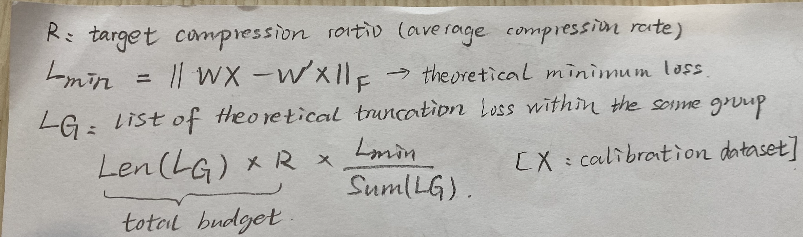
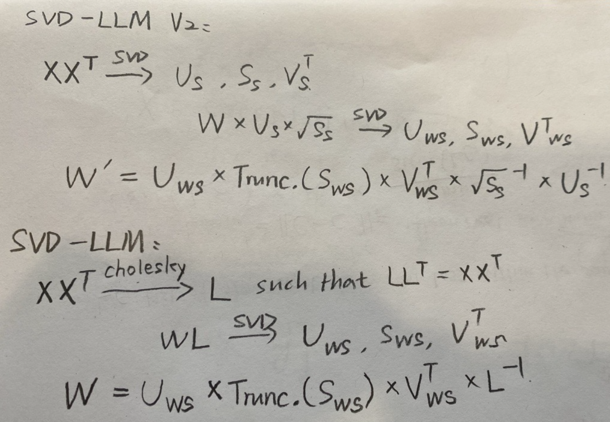
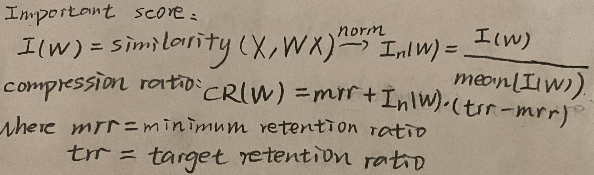
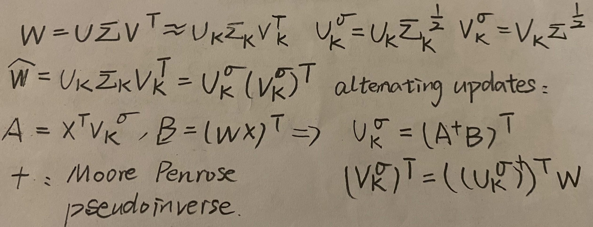
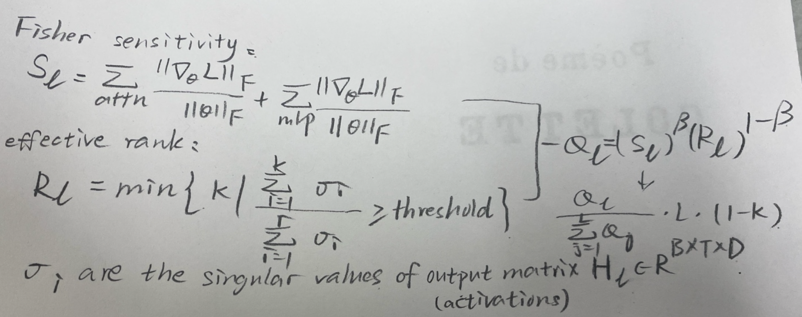
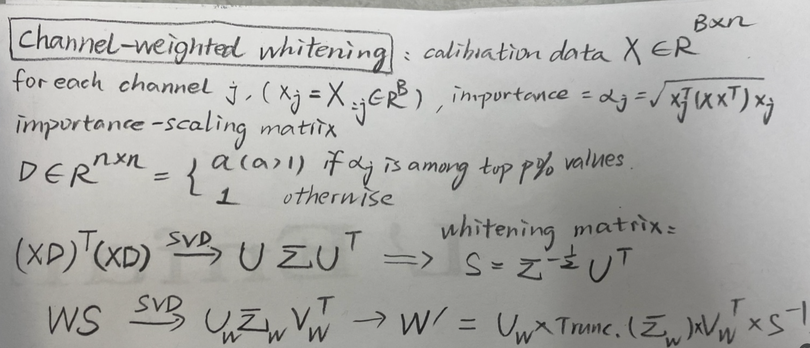

# Related Work

SVD-LLM V2:
- dynamic compression ratio:
    - 
- two-step SVD instead of Cholesky decomposition
    - 

AdaSVD:
- dynamic compression ratio:
    - 
- alternating updates (no supervised lora at all):
    - 

DipSVD:
- dynamic compression ratio:
    - 
- channel-weighted whitening:
    - 